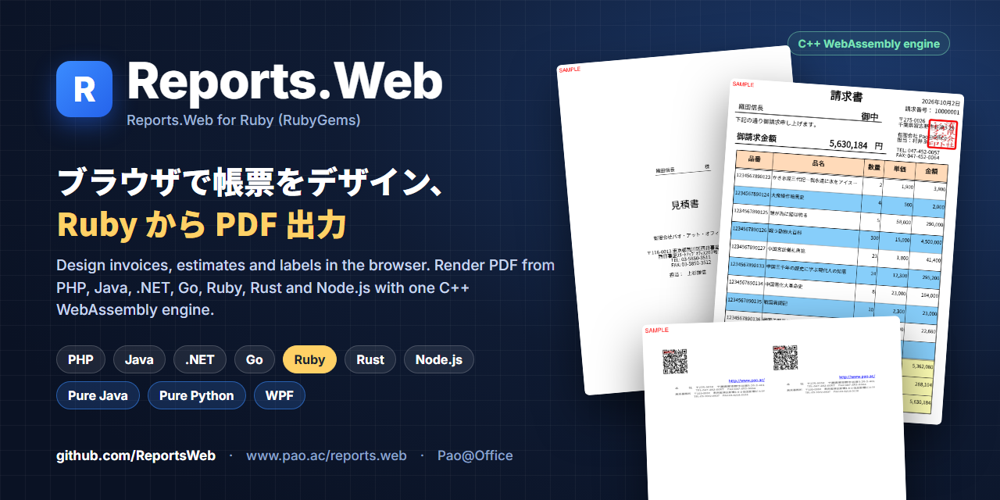
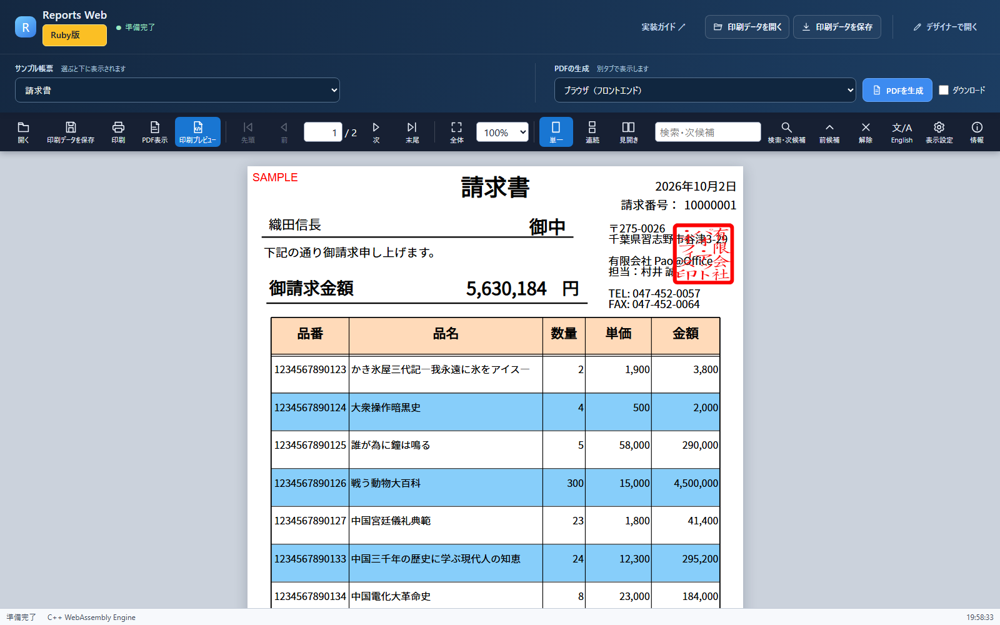

<p align="center"></p>

# Reports.Web — Ruby サンプル

[](https://rubygems.org/gems/reports_web)
[](https://github.com/ReportsWeb/engine)
[](https://www.pao.ac/demo/reports.web/samples/ruby/)

**Reports.Web** は、ブラウザで帳票をデザインし、いろいろな言語から PDF を作る帳票ツールです。このリポジトリは、**Ruby** から使うサンプル（製品の配布 ZIP に入っているサンプル）です。

請求書・見積書・納品書・宛名ラベル・名刺など、日本の業務帳票をそのまま作れます。帳票のレイアウトはブラウザのデザイナーで作り、アプリは値を入れて「印刷データ（PREPEJ）」を作るだけです。描画は C++ WebAssembly の帳票エンジンが行います。

- 製品サイト：https://www.pao.ac/reports.web/
- オンラインデモ：https://www.pao.ac/demo/reports.web/samples/ruby/
- gem：[`reports_web`](https://rubygems.org/gems/reports_web)
- 帳票エンジン（Docker）：[`ghcr.io/reportsweb/engine`](https://github.com/ReportsWeb/engine)

| デザイナー（ブラウザ） | Ruby のサンプル（プレビュー） |
|---|---|
|  |  |

## サンプルを選ぶ

| # | フォルダー | 内容 | ポート |
|:-:|---|---|---|
| 01 | [01.あっという間に帳票出力](01.あっという間に帳票出力/README.md) | 短い Ruby コードで、1 ページの帳票を表示・PDF 出力 | http://127.0.0.1:19260/ |
| 02 | [02.全帳票をWebでプレビュー](02.全帳票をWebでプレビュー/README.md) | Sinatra と PostgreSQL で 8 種類の帳票（請求書・見積書・郵便番号 81 ページなど）を作る Web アプリ | http://127.0.0.1:19261/ |
| 03 | [03.Web API・REST連携](03.Web%20API・REST連携/README.md) | 02 と同じ帳票処理を Web API にし、別の利用側 Web アプリから呼ぶ | http://127.0.0.1:19262/ |

迷ったら 01 から順にどうぞ。各フォルダーは独立していて、別々に起動・停止できます。

## クイックスタート

必要なのは Docker（Docker Desktop など）だけです。Ruby や PostgreSQL をパソコンに入れる必要はありません。

```sh
git clone https://github.com/ReportsWeb/wasm-ruby.git
cd "wasm-ruby/01.あっという間に帳票出力"
docker compose up -d --build --wait --wait-timeout 180
# ブラウザで http://127.0.0.1:19260/ を開く
docker compose down --volumes   # 終わったら停止・削除
```

## コードの要点

```ruby
require 'reports_web'

print_data = PaoReportsWeb::PrintData.new
  .set_definition(definition)          # ブラウザのデザイナーで作った .prepdj
  .page_start
  .set_value('Title', 'あっという間に帳票出力')
  .page_end

pdf = PaoReportsWeb::ReportsWebEngine.new(url: 'http://engine:3107').render_pdf(print_data)
```

## しくみ

```
Ruby アプリ ──(印刷データ PREPEJ / JSON)──▶ 帳票エンジン ghcr.io/reportsweb/engine ──▶ PDF
     ▲                                             （C++ WebAssembly、Docker）
 帳票定義 .prepdj（ブラウザのデザイナーで作成）
```

各サンプルの `compose.yaml` は、帳票エンジンのイメージを起動し、同じイメージからデザイナー・プレビュー画面のファイルを取り出して使います。DB の初期化 SQL とサンプルデータは [common/database](common/database/) にあり、02・03 の起動時に、サンプルごとの PostgreSQL へ自動で読み込まれます。

## 体験版と製品版

gem と帳票エンジンは**体験版**で、出力には赤い「SAMPLE」の印が付きます。ご購入後に納品するライセンスファイルを帳票エンジンに設定すると印が消えます（開発用パソコン 1 台につき 1 ライセンス、運用環境はランタイムライセンスフリー）。

- ご購入・お見積もり：https://www.pao.ac/reports.web/buy.html
- 使用許諾：https://www.pao.ac/reports.web/manual/index.html#16

このリポジトリのサンプルコードは [MIT License](LICENSE) です。gem と帳票エンジンには Reports.Web の使用許諾が適用されます。

## ほかの言語

同じ帳票定義・印刷データを、PHP・Java・.NET・Go・Ruby・Rust・Node.js から使えます。Pure Java・Pure Python・WPF 版もあります。→ https://github.com/ReportsWeb

`Manual/` のプログラマーズガイドは配布 ZIP 向けに書かれています。このリポジトリでは、`PrintData` を同梱ファイルではなく gem から読み込みます。

---

## English

**Reports.Web** is a report designer and PDF engine. Design report layouts (invoices, estimates, delivery slips, address labels, business cards) in the browser, then build print data (PREPEJ JSON) from your application and render PDF with the C++ WebAssembly engine. This repository contains the **Ruby** samples shipped in the product ZIP.

- Gem: [`reports_web`](https://rubygems.org/gems/reports_web)
- Engine: [`ghcr.io/reportsweb/engine`](https://github.com/ReportsWeb/engine) (Docker)
- Live demo: https://www.pao.ac/demo/reports.web/samples/ruby/

Quick start: install Docker, then

```sh
git clone https://github.com/ReportsWeb/wasm-ruby.git
cd "wasm-ruby/01.あっという間に帳票出力"
docker compose up -d --build --wait --wait-timeout 180   # open http://127.0.0.1:19260/
```

The gem and the engine are trial builds; output carries a red "SAMPLE" mark until a purchased license file is configured. Sample code: MIT. Gem and engine: Reports.Web license.

Pao@Office — https://www.pao.ac/ — info@pao.ac
